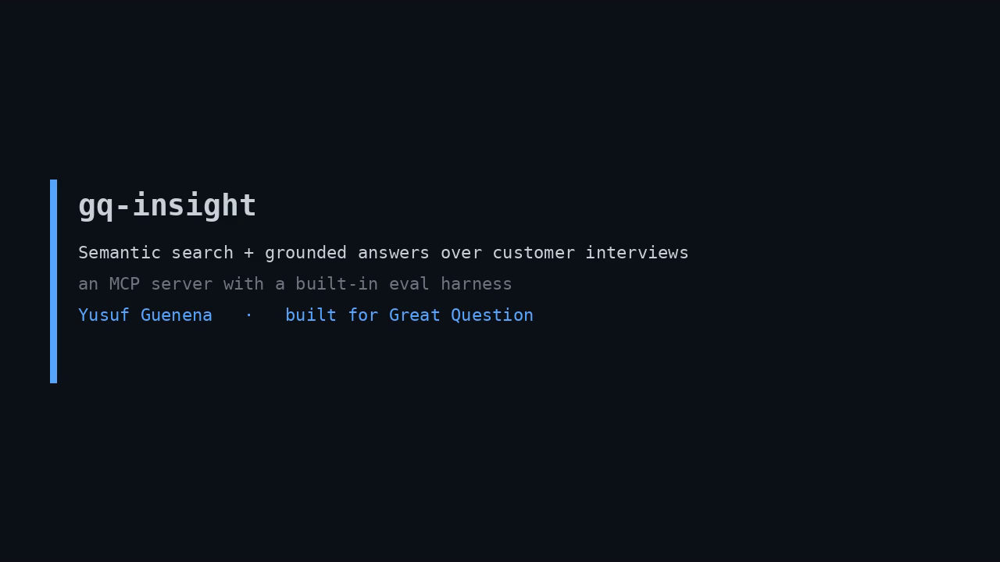

# gq-insight-mcp

**Semantic search and grounded answering over customer-research interviews, exposed as an MCP server, with a built-in evaluation harness.**

Built for [Great Question](https://greatquestion.co)'s AI engineering internship. It deliberately implements three things straight from the job description:

- **Semantic search across interview hours** — embed every interview turn, retrieve the most relevant verbatim quotes, each traceable to an interview, timestamp, and speaker.
- **MCP tool structuring** — the search, answer, and eval capabilities are exposed as Model Context Protocol tools any LLM agent can call.
- **Evals and quality measures across MCP tools** — a labeled query set scored on recall@k, MRR, nDCG, and answer-**faithfulness**, gated in CI.

> The guiding rule: an answer may only assert what a retrieved quote supports, every claim carries a citation, and an answer that cannot be grounded is **refused, not fabricated**. Agentic research tooling is bottlenecked on faithfulness, not fluency.

## Demo

[](assets/gq-insight-demo.mp4)

*A 65-second narrated walkthrough: semantic search, a grounded cited answer, and the live eval scorecard. (`assets/gq-insight-demo.mp4`)*

## What it does

```
$ gq-insight search "why do customers churn?"
1. [INT006 @ 00:42 (P-6675)]  score=0.3856
   "The automation rules. I built a rule engine that auto-categorizes ..."
2. [INT005 @ 07:40 (P-5093)]  score=0.3801
   "The automation rules were genuinely good, and switching cost me three weeks ..."

$ gq-insight answer "what blocks the enterprise rollout?"
"SSO. We mandate SAML single sign-on for anything that touches employee data ..." [INT008 @ 00:45] ...
  faithful: True  (every claim cites a real quote)

$ gq-insight eval
recall@k 0.900 · MRR 0.790 · nDCG@k 0.837 · faithfulness 1.000 · ALL GATES PASS
```

## How it works

```
data/transcripts/*.txt   8 customer interviews, parsed into citable speaker turns
        │
   corpus.py             turn = (interview, timestamp, speaker, text) -> the citation unit
        │
   index.py              all-MiniLM-L6-v2 embeddings, cosine retrieval
        │                (interviewer turns indexed for context, excluded from results)
        ├── answer.py     quote-grounded answers; faithfulness verified before return
        │                 extractive (offline) or Ollama synthesis (verified, with fallback)
        └── eval.py       recall@k / MRR / nDCG@k / faithfulness vs evals/queries.jsonl
        │
   server.py             FastMCP server: search_interviews, answer_with_citations,
                         list_themes, run_eval
```

The corpus here is 8 interviews; the retrieval contract is unchanged when you swap the exact cosine search for an approximate index (FAISS/HNSW) at "tens of thousands of hours."

## Quickstart

```bash
pip install -e .
gq-insight themes                                   # list the corpus
gq-insight search "mobile receipt capture problems"
gq-insight answer "why did customers leave?"        # add --backend ollama for local-LLM synthesis
gq-insight eval                                     # quality scorecard + CI gates
pytest -q                                           # 14 tests
```

Embeddings run on CPU from a small cached model; no API keys, fully offline.

### As an MCP server

```bash
gq-insight-server      # stdio transport
```

Register it with any MCP client (Claude Desktop, an agent runtime) to give the agent
`search_interviews`, `answer_with_citations`, `list_themes`, and `run_eval` tools.

## Evaluation (honest numbers)

On a 10-query labeled set (`evals/queries.jsonl`), all-MiniLM-L6-v2, k=6:

| metric | value | what it means |
|---|---|---|
| hit@k | 1.00 | every query surfaces a relevant interview in top-k |
| recall@k | 0.90 | fraction of relevant interviews retrieved |
| MRR | 0.79 | mean reciprocal rank of the first relevant hit |
| nDCG@k | 0.84 | rank-quality of the retrieved set |
| faithfulness | 1.00 | fraction of answers with every claim grounded in a real quote |

Two queries (onboarding, integrations) rank the right interview 4th-5th rather than 1st: a real limitation of a small embedder on abstract queries over concrete transcript language. They are kept in the set so the gate stays honest. CI gates are conservative floors (recall ≥ 0.80, MRR ≥ 0.70, faithfulness = 1.00), set below measured performance so the gate catches regressions without being gamed.

## Note on the data

The interviews are synthetic but realistic, written for a fictional expense/invoicing product ("Northwind") so the recurring research themes (onboarding friction, pricing surprises, integration gaps, churn drivers, support, security) give retrieval real signal. No real customer data.

## License

MIT — Yusuf Guenena
